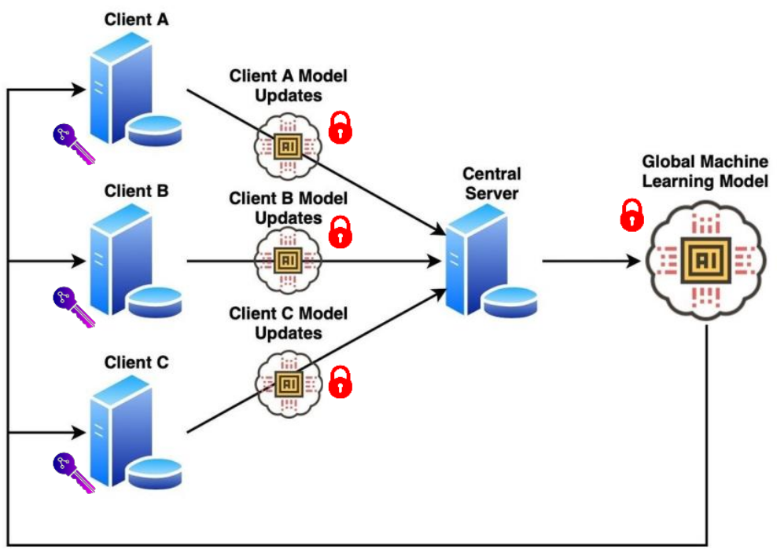

# Somewhat Homomorphically Encrypted Federated Learning (SHEFL)


Overview
------

* This is the official repository of the paper [**Encrypted federated learning for secure decentralized collaboration in cancer image analysis**](https://www.medrxiv.org/content/10.1101/2022.07.28.22277288v1).
* Pre-print version: [https://doi.org/10.1101/2022.07.28.22277288](https://doi.org/10.1101/2022.07.28.22277288)





Introduction
------
Federated learning with homomorphic encryption enables multiple parties to securely co-train artificial intelligence models in pathology and radiology, reaching state-of-the-art performance with privacy guarantees.


### Prerequisites

The software is developed in **Python 3.8**. For the deep learning, the **PyTorch 1.4** framework is used. The secure federated learning process was developed using **PySyft 0.2.9**.


Main Python modules required for the software can be installed from ./requirements in three stages:

1. Create a Python3 environment by installing the conda `environment.yml` file:

```
$ conda env create -f environment.yml
$ source activate SHEFL
$ pip install syft==0.2.9
```


2. Install the remaining dependencies from `requirements.txt`.


**Note:** These might take a few minutes.


Code structure
---

Our source code for secure federated learning using homomorphic encryption for both the radiology and pathology parts as well as training and evaluation of the deep neural networks, MR image analysis and preprocessing, 3D data augmentation, and gradient inversion attack are available here.

1. Everything for the radiology can be run from *./main_3D_brats.py*. 
* The data preprocessing parameters, directories, hyper-parameters, and model parameters can be modified from *./configs/config.yaml*.
* Also, you should first choose an `experiment` name (if you are starting a new experiment) for training, in which all the evaluation and loss value statistics, tensorboard events, and model & checkpoints will be stored. Furthermore, a `config.yaml` file will be created for each experiment storing all the information needed.
* For testing, just load the experiment which its model you need.

2. The rest of the files:
* *./models/* directory contains all the model architectures and losses.
* *./data/* directory contains all the data preprocessing, 3D augmentation, and loading files.
* *./Train_Valid_brats.py* contains the training and validation processes of radiology.
* *./gradient_inversion/* directory contains all the files for gradient inversion attack.
* *./pathology/* directory contains all the files for the pathology part. The exact same structure exists in *./pathology/* as for the radiology part. Everything for the pathology can be run from *./main_pathology.py*. *./Train_Valid_pathology.py* contains the training and validation processes of pathology. ./Prediction_pathology.py* contains the evaluation process of pathology.

**Note:** All source codes for the [histological image analysis](https://github.com/KatherLab/HIA) and [histological image preprocessing](https://github.com/KatherLab/HIA) are available at https://github.com/KatherLab.

Datasets availability
---
The data that support the findings of this study are in part publicly available, in part proprietary datasets provided under collaboration agreements. 
* BraTS20 dataset is public under: [link](https://www.med.upenn.edu/cbica/brats2020/data.html).
* Data (including histological images) from the TCGA database are available at: [link](https://portal.gdc.cancer.gov/). 
* All molecular data for patients in the TCGA cohorts are available at: [link](https://cbioportal.org). 
* Data access for the Northern Ireland Biobank can be requested at: [link](http://www.nibiobank.org/for-researchers). 
* All other data can be requested from the respective study groups who independently manage data access for their study cohorts.

### In case you use this repository, please cite the original paper:

D. Truhn, S. Tayebi Arasteh et al. "*Encrypted federated learning for secure decentralized collaboration in cancer image analysis*". medRxiv, https://doi.org/10.1101/2022.07.28.22277288, 2022.

### BibTex

    @article {SHEFL2022,
      author = {Truhn, Daniel and Tayebi Arasteh, Soroosh and Saldanha, Oliver Lester and Mueller-Franzes, Gustav and Khader, Firas and Quirke, Philip and West, Nicholas P. and Gray, Richard and Hutchins, Gordon G. A. and James, Jacqueline A. and Loughrey, Maurice B. and Salto-Tellez, Manuel and Brenner, Hermann and Brobeil, Alexander and Yuan, Tanwei and Chang-Claude, Jenny and Hoffmeister, Michael and Foersch, Sebastian and Han, Tianyu and Keil, Sebastian and Schulze-Hagen, Maximilian and Isfort, Peter and Bruners, Philipp and Kaissis, Georgios and Kuhl, Christiane and Nebelung, Sven and Kather, Jakob Nikolas},
      title = {Encrypted federated learning for secure decentralized collaboration in cancer image analysis},
      elocation-id = {2022.07.28.22277288},
      year = {2022},
      doi = {10.1101/2022.07.28.22277288},
      publisher = {Cold Spring Harbor Laboratory Press},
      URL = {https://www.medrxiv.org/content/early/2022/07/31/2022.07.28.22277288},
      eprint = {https://www.medrxiv.org/content/early/2022/07/31/2022.07.28.22277288.full.pdf},
      journal = {medRxiv}
    }
